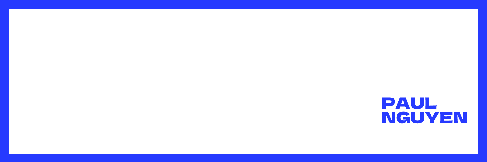

  

# Hi there, I'm Tran Duy Bao Nguyen (TSSniper349) 👋

**Student | Developer | Tech Enthusiast**

I'm a passionate Computer Science student at [The University of Adelaide](https://www.adelaide.edu.au/) based in Adelaide, Australia. I love creating solutions that make a difference and am always eager to learn new technologies and collaborate on exciting projects.

  
  
  
  
  

---

## About Me

- 🎓 **Student** at [The University of Adelaide](https://www.adelaide.edu.au/)
- 🌏 **Location:** Adelaide, Australia
- 💡 **Interests:** Machine Learning, Computer Vision, and building tech solutions that address real-world challenges.
- 🎯 **Goals:** Enhance my coding skills, contribute to impactful projects, and continually expand my knowledge in modern technologies.

---

## Skills & Technologies

  
  
  
  
  
  
  

---

## Projects & Contributions

### Pinned Repositories

- [**Volunteer_Connect**](https://github.com/TSSniper349/Volunteer_Connect) - A platform to connect volunteers with organizations.
- [**Comprehensive Emergency Guide**](https://github.com/TSSniper349/ComprehensiveEmergencyGuide) - An HTML-based emergency guide for quick access during crises.
- [**Traffic or Tragic**](https://github.com/TSSniper349/Traffic_Lights_Game) - A simple relaxing game?
- [**Ready2Eat**](https://github.com/TSSniper349/Ready2Eat) - A project aimed at revolutionizing canteen food ordering.
- [**khkt2223**](https://github.com/TSSniper349/khkt2223) - Study for early dyslexia diagnosis on young children and develop supporting system.
- [**maskdetectionkhkt2021**](https://github.com/TSSniper349/maskdetectionkhkt2021) - Leveraging machine learning for effective mask detection.

*(Explore my repositories for more projects and code samples.)*

---

## GitHub Stats

  

  

---

## Get in Touch

I'm always excited to connect and collaborate on innovative projects. Whether you have a great idea or just want to chat about tech, feel free to reach out!

---

*This README is a living document – evolving as my skills and projects grow. Let's build something awesome together!*
